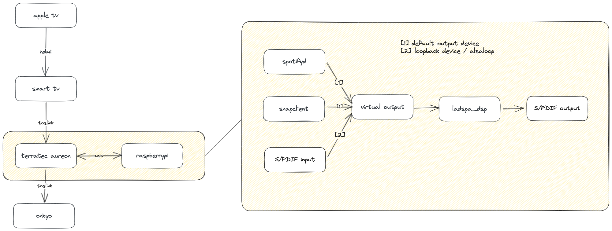

# 🔊 Sound System
My personal home sound system setup, automated with Makefile.



Built using open-source software:
 * [Raspotify](https://github.com/dtcooper/raspotify) - Systemd wrapper around popular Spotify Connect client — [Librespot](https://github.com/librespot-org/librespot).
 * [dsp](https://github.com/bmc0/dsp) - [Digital singal processor](https://en.wikipedia.org/wiki/Digital_signal_processor) used for [room correction](https://en.wikipedia.org/wiki/Digital_room_correction)
 * [Onkyo eISCP Control](https://github.com/miracle2k/onkyo-eiscp) - Controller for my Onkyo amplituner for turning the device on/off remotely.

All components are glued together using:
 * [ALSA](https://www.alsa-project.org/wiki/Main_Page) - Core linux audio functionality.
 * [LADSPA](https://www.ladspa.org/) - API for linux audio plugins.

## 🛠️ Dependencies
First install all dependencies needed by the Makefile to build the system on your device.
```
sudo apt install -y git libasound2-dev libssl-dev pkg-config python3-venv python3.9-dev ladspa-sdk
sudo apt-get -y install curl && curl -sL https://dtcooper.github.io/raspotify/install.sh | sh
```

## 🚀 Installation
 * `make` to build all the tools from source.
 * `sudo make install` to install and run all system components.
 * `sudo make uninstall` to stop and remove all components.
 * `make clean` to remove the build directory.

## ⚙️ Configuration
This part is still work in progress.. Each configuration file/script is stored in templates folder. Inside them there are variables with double curly braces, which are replaced at build time. This way you can build different setups derived from default by overriding Makefile variables.

This may change in future with addition of `./configure` script which will make the configuration step more user friendly.

## Terratec Aureon 7.1 USB
I use Terratec sound card to:
 * Capture audio from TV via S/PDIF optical cable
 * Capture audio from my DJ console via standard jack cable
 * Output audio to the Onkyo amplituner via another S/PDIF optical cable

Captured audio is sent to Raspberry PI for mixing with other sources like Raspotify.
After all the transformations it gets sent back to this device for playback.

### Configuration
You can adjust this sound card's controls using either `alsamixer` TUI, or `amixer` CLI.
The device itself has 4 sources:
 * Mic 1 - 2 channel input for Microphone #1
 * Mic 2 - 2 channel input for Microphone #2
 * Line - 4 channel Jack input
 * IEC958 - 4 channel S/PDIF (optical) input

`switch-jack-tv.sh` script makes it easy to toggle between Jack and TV input.

## Snapcast dependencies
Snapcast integration is work in progress...
```
sudo apt-get install build-essential cmake
sudo apt-get install libasound2-dev libpulse-dev libvorbisidec-dev libvorbis-dev libopus-dev libflac-dev libsoxr-dev alsa-utils libavahi-client-dev avahi-daemon libexpat1-dev
```
